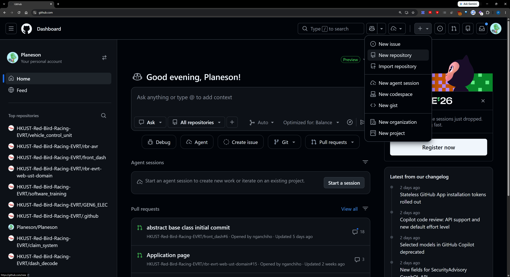
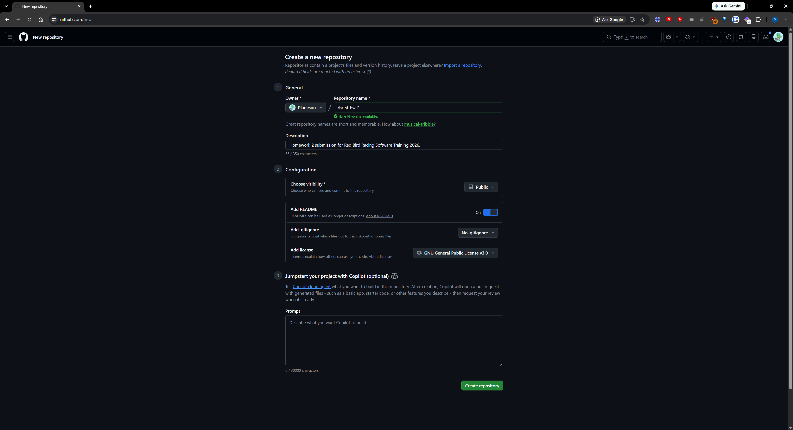
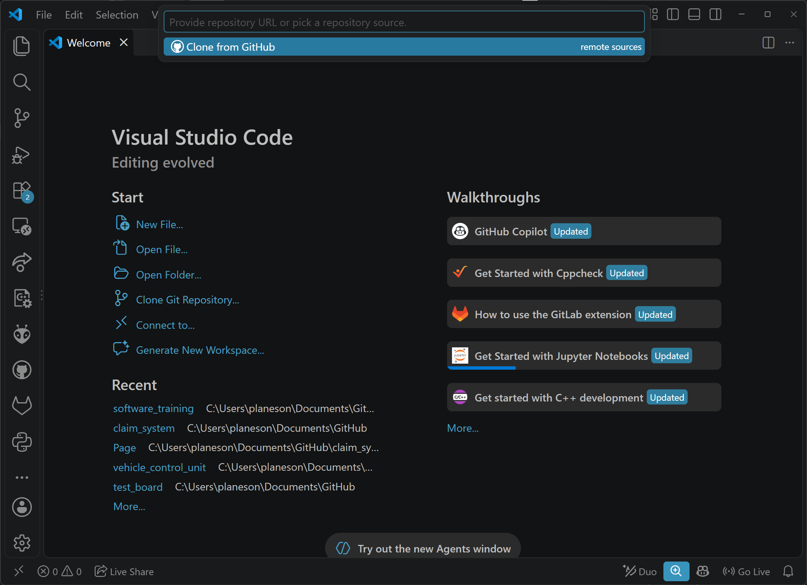
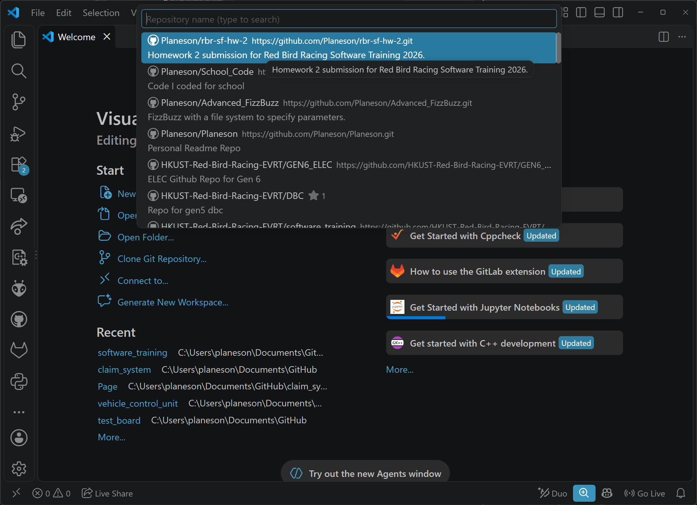
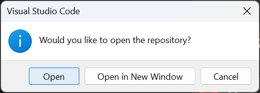
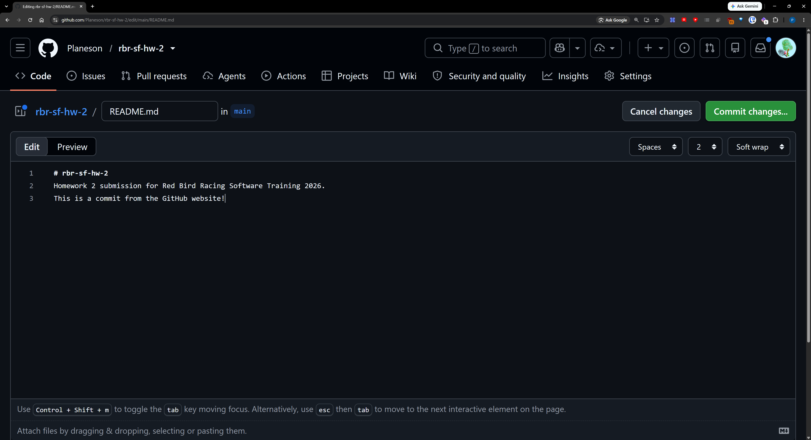
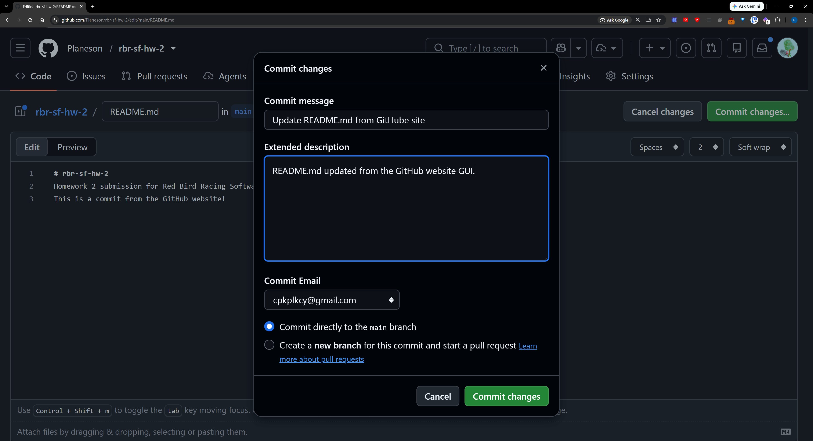

# Homework 2: Git and GitHub
## Introduction
This homework is to let you experience using Git and GitHub yourself. After completing this homework, you should be familiar with how to work with these tools. The order of the tasks is as laid out in the PowerPoint slides. Finish all the tasks, and provide a link to your repository on the [training website](https://rbrevrt.hkust.edu.hk/training).  

To ensure you are doing Git properly, you need to edit the files before commiting. I ***WILL*** check your commit history. As a reminder, you can't fake commit history (unless you start from scratch).  

You are suggested use VSCode Source Control to complete this homework. You may also work with the Git cli if you wish but you will be on your own. Commits via the Git website would receive half credit, except when specified.

## Tasks
1. Creating your own repo
2. Pulling, committing, pushing
3. Branching
4. Merging
5. Pull Requests, resolving conflicts
6. CI/CD
7. Give answers to questions in `answers.md`

### Task 1: Creating your own repo
Go to [GitHub](https://github.com/) and create your own repo. In the top right, there is a `+` sign, then choose `New repository`.  
  

Fill in the information required for the new repo.
- Name: `rbr-sf-hw-2`
- Description: `Homework 2 submission for Red Bird Racing Software Training 2026.`
- Visisbility: `Public`
- Add README: `On`
- Add License: `GNU General Public License v3.0`
  

Press `Create repository` to create the repo. You should see the contents of your new repo.
  

### Task 2: Pulling, committing, pushing
Launch a new VSCode window. Make sure you are signed in (bottom left). Click `Clone Git Repository...`, then `Clone from GitHub`. 

You should see your newly created repo show up. Choose it to clone it.

Choose a place to store your repo, I suggest using a folder to hold all your GitHub repos, e.g. Documents/GitHub. A pop-up should appear, just choose `Open` (since this is already a new window; if you are doing this from an open window, then choose `Open in New Window`).

After the window finish loading, go to the left bar and choose `Source Control` (or use the shortcut Ctrl+Shift+G). This is basically the VSCode GUI for Git. You can go back to Explorer (Ctrl+Shift+E) to edit the files.

Go back to GitHub. Click `README.md` to open it.

Press the `Edit this File` button to edit the file.

The file should open up. Add this line below it:  
`This is a commit from the GitHub website!`  
then press the green `Commit changes...` button.

The commit message should be `Update README.md from GitHub site`, and the extended description should be `README.md updated from the GitHub website GUI.`. Press the green `Commit changes` button to commit your changes.  
~ignore the typo on the images and example repo~

Note: this commit ***MUST*** be done from the GitHub website, else you receive half credit. 

Go back to VSCode. You should see that you have 1 commit down and 0 commits up. You can see the commit history on the Graph. Note the Incoming Changes from origin/main. Press the refresh button new to main to pull the commit down. You should pull every time you know or suspect there are upstream changes. After pulling the commit, the Incoming Changes line should disappear, and the colour of the tree should change.

Click Explorer and open `README.md`. You should see the changes reflected. Right click README.md and choose `Reveal in File Explorer` to show the file in File Explorer.

For simplicity sake, I provided altered files for you to "simulate" commits. Simply paste them from this repo into the repo you are submitting.

## Checklist
- [x] Read the entire instructions file
- [ ] Finished all the tasks
- [ ] `answers.md` is filled in
- [ ] Link to repo sent on the [training website](https://rbrevrt.hkust.edu.hk/training)